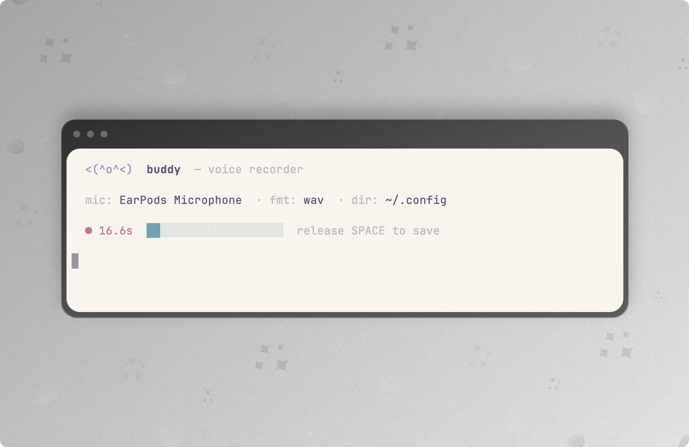

# buddy

hold **space** to record · release to save · ctrl+c to quit

saves timestamped files (`2026-04-07_14-30-22.wav`) to your current directory, or wherever you point it.

---

## install

```bash
pipx install .
```

## usage

```bash
buddy                        # wav to current dir, picks mic on first run
buddy -o ~/recordings        # save to a specific folder
buddy -f mp3                 # save as mp3 (also: flac, ogg)
buddy -f ogg -o ~/voice      # combine flags
buddy --pick                 # re-select microphone
buddy --list                 # list available input devices
```

mic choice is remembered between runs (`~/.config/buddy/config.json`).

---

## requirements

- python 3.9+
- a microphone
- `libportaudio` — `brew install portaudio` on mac, `apt install libportaudio2` on linux, nothing on windows

> **macos:** grant accessibility permission on first run — system settings → privacy → accessibility

## uninstall

```bash
pipx uninstall buddy-recorder
```
